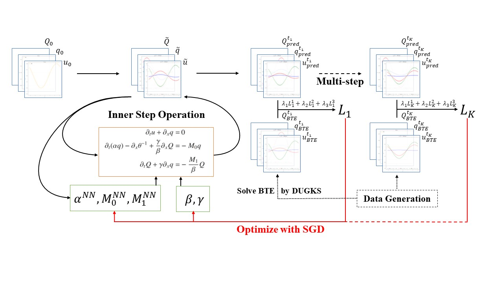

# HeatModelMDFM
The codes are for the paper

[Modeling Heat Conduction with Two-Dissipative Variables: A Mechanism-Data Fusion Method](https://arxiv.org/abs/2212.11508)

<div  align="center">

</div>

# Setup

All codes were developed and tested with Python 3.8, and were implemented by pytorch 1.10.1.

# Training

Code and default options can be found in train.py. You can simply modify these default options to benefit training.  

```
python train.py
```

Trained parameters will be stored in directory like `./BTEdataU01N10/net_params_U01N10Coarse1steps1.pkl`.

[Download training and testing data](https://disk.pku.edu.cn/link/AAF733D3A09571462A9D55C29127541EC6) and make your working directory like this:

```
traindata/
testdata_075_085/
testdata_discontinuous_cases/
train-predict/
    train.py
    predict.py
```


# Testing

```
python predict.py
```

You can change the default options in `predict.py` to test different settings. Remember to change the CDFfile_path.
